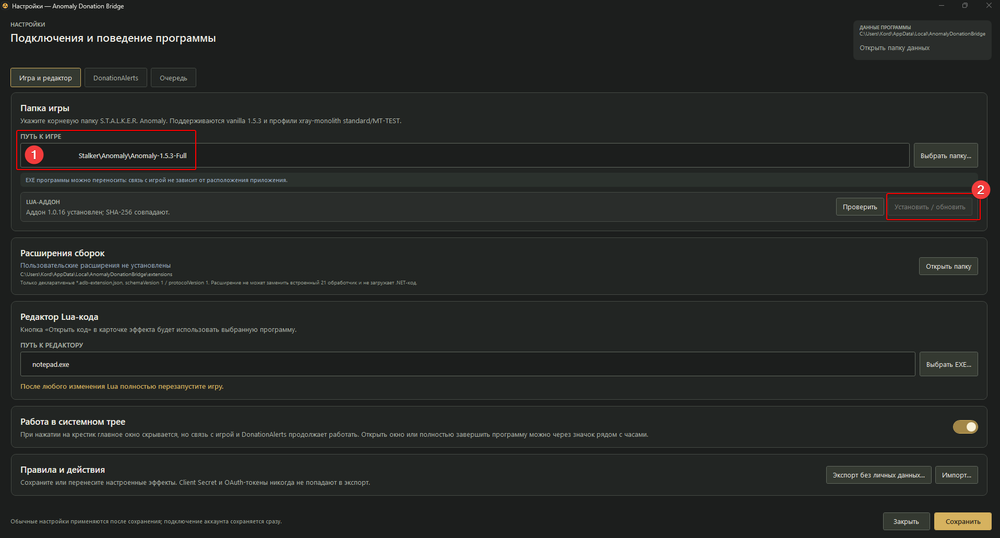
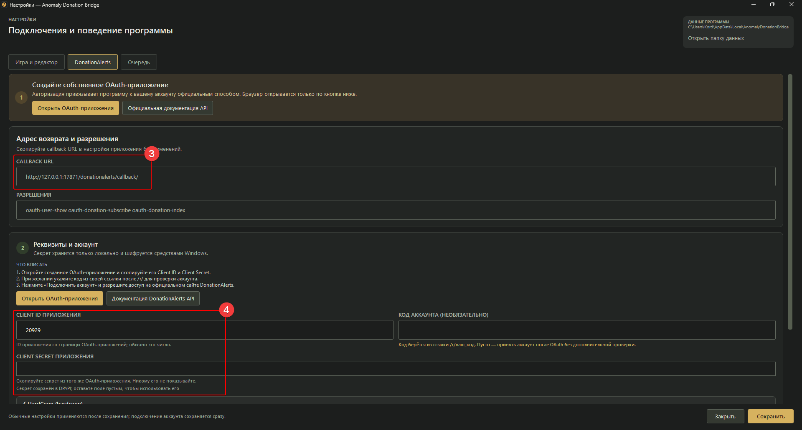
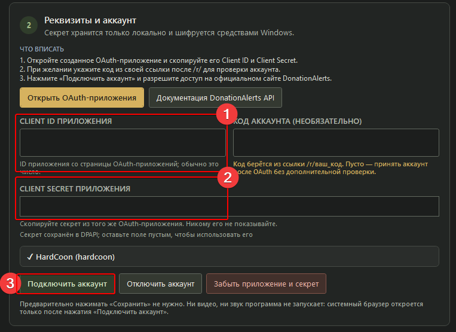
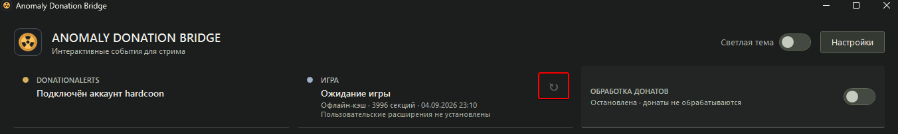

# Anomaly Donation Bridge

Донаты DonationAlerts запускают выбранные вами эффекты в S.T.A.L.K.E.R. Anomaly 1.5.3.
Для Windows x64. Версия программы — 1.0.67 Beta, аддона — 1.0.38.

Изменения версии: [слышимое воспроизведение анекдотов и изменения компактного интерфейса](docs/RELEASE_1.0.67_BETA_RU.md).

## Установка

Скачайте [ZIP с программой](https://github.com/hardcoon/anomaly-donation-bridge/releases/download/v1.0.67-beta.1/AnomalyDonationBridge-1.0.67-beta.1-win-x64.zip),
распакуйте целиком в удобную папку и запустите `AnomalyDonationBridge.exe`.
Папки `addon-package` и `effects` оставьте рядом с программой. В архиве нет
рабочих документов, старых скриптов, пользовательских настроек и истории.

Закройте игру. В **Настройки → Игра и редактор** укажите папку Anomaly,
дождитесь автоматической проверки и при необходимости нажмите
**Установить / обновить аддон и эффекты**. Одна кнопка устанавливает игровой
аддон и все выбранные файлы пресетов; после установки полностью перезапустите
игру.



При использовании MO2 укажите в настройках корень отдельного включённого мода
для файлов пресетов, затем нажмите общую кнопку установки. Игровой аддон
программа установит в указанную папку игры, а пресеты — в мод MO2.

Файлы пресетов лежат в `effects\gamedata\scripts` рядом с EXE. Можно удалить
ненужные или добавить свои `.script` до установки: один файл — один пресет.
Карточка появляется только после установки файла в игру и перезапуска игры.
Прежние пользовательские пресеты и суммы сохраняются.

## Подключение DonationAlerts

В **Настройки → DonationAlerts** нажмите **Открыть OAuth-приложения**.
На сайте создайте новое приложение с любым понятным названием, например
`Anomaly Donation Bridge`. В поле **URL перенаправления** вставьте этот адрес
целиком, включая последний `/`, и сохраните:

```text
http://127.0.0.1:17871/donationalerts/callback/
```



Откройте созданное приложение на сайте. Скопируйте **ID приложения** в поле
**Client ID**, а его секретный ключ (**Client Secret**, на сайте может называться
**Ключ API**) — в **Client Secret**. Это данные вашего OAuth-приложения,
не ссылка на страницу донатов. Каждый пользователь создаёт своё приложение;
значения на скриншотах приведены только для примера.

Нажмите **Подключить аккаунт** и разрешите доступ в браузере. Поле **Код аккаунта**
можно оставить пустым. Никому не передавайте Client Secret.



## Каталог игры

Запустите Anomaly и обязательно загрузите сохранение. В программе нажмите **↻**
рядом со статусом игры. Затем вернитесь в игру и снимите паузу: можно просто
постоять или побегать, пока закончится сканирование. При наличии второго
монитора вынесите туда окно программы, чтобы видеть прогресс.



Сканирование нужно при первом подключении и после изменения сборки или модов,
которые добавляют либо меняют игровые секции. На неизменной сборке обновлять
каталог перед каждым запуском не нужно.

Недоступные и небезопасные секции по умолчанию скрыты. Для диагностики их можно
показать через **Настройки → Общие настройки → Скрывать недоступные секции**:
они будут отмечены бледно-красным, но останутся заблокированными.

## Настройка эффектов

1. Во вкладке **Пресеты** выберите эффект, нажмите **Настроить**, сохраните
   параметры и добавьте его **В пользовательский пресет**.
2. Во вкладке **Пользовательские пресеты** назначьте суммы кнопкой **+ Сумма**
   и нажмите **В активные**. Один пресет можно сохранить несколько раз с
   разными параметрами и ценами.
3. Проверьте действие кнопкой **Тест** на копии сохранения.
4. Включите **Обработку донатов** в верхней части окна.

В **Настройки → Горячие клавиши** можно назначить глобальные сочетания для
включения или остановки обработки, повтора последнего доната и запуска любого
активного пресета по его номеру. Они работают поверх игры. Быстро назначить
сочетание отдельному активному пресету можно через его меню **⋯**.

В **Настройки → Общие настройки** можно включить **Колесо фортуны**: если за
указанное число минут не приходит донат, программа сама запускает случайный
активный пресет. Значение `0` отключает функцию; главный переключатель обработки
донатов на неё не влияет.

Кнопка **Профили** создаёт независимые заготовки из пользовательских пресетов и
активных вариантов с суммами. При создании профиля пользовательские пресеты
текущего профиля можно скопировать отдельным чекбоксом, который включён по
умолчанию. Это позволяет быстро переключать стиль игры, не затрагивая
подключение DonationAlerts, очередь, историю и общие настройки.

Во вкладке **Активные** компактная строка показывает все назначенные суммы и
кнопку **Настроить**. В **Пользовательских пресетах** отображаются первые три
суммы и быстрые кнопки **Настроить**, **+ Сумма** и **В активные**.

В истории отображаются очередь и обратный отсчёт до следующего эффекта. Общая
пауза между эффектами не теряет донат: событие остаётся в очереди до запуска.
Ещё не отправленные эффекты сохраняются и после перезапуска программы.

Если включена **Работа в системном трее**, крестик скрывает окно, а программа продолжает работать. Открыть её, включить или остановить обработку донатов и полностью выйти можно через значок рядом с часами.

Лицензия — [Hardcoon No-Resale License 1.0](LICENSE): программу можно бесплатно
использовать, изменять и бесплатно распространять, но нельзя перепродавать,
платно раздавать или включать в платный сервис без письменного разрешения
Hardcoon.
